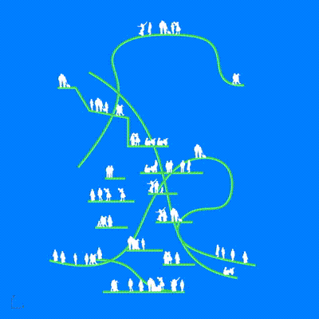

# ADR2 GSAPP In-Class Grasshopper Demos
Grasshopper example files for ADR2 GSAPP.

## Warmup
A series of fast-pace in-class exercises.
- [warmup .3dm + .gh files](1_warmup)

## Populate in real-time section drawings with people (or any other 2D shape).

- [warmup .3dm + .gh files](2_place_people)

Inputs:
- Any curve geometry.
- 2D shapes to randomly place along your curve geometry.

Outputs:
- Randomly placed 2D shapes along your curve geometry.

GH files:
- [simple demo to show placing logic](place-stuff.gh)
- [full demo](place-stuff.gh)

3DM file: 
- [Rhino reference file](placepeep.3dm)

Dependencies:
- https://www.food4rhino.com/en/app/human

How to install plugins? Follow this tutorial: https://parametricbydesign.com/grasshopper/tutorials/installing-grasshopper-and-plugins/

