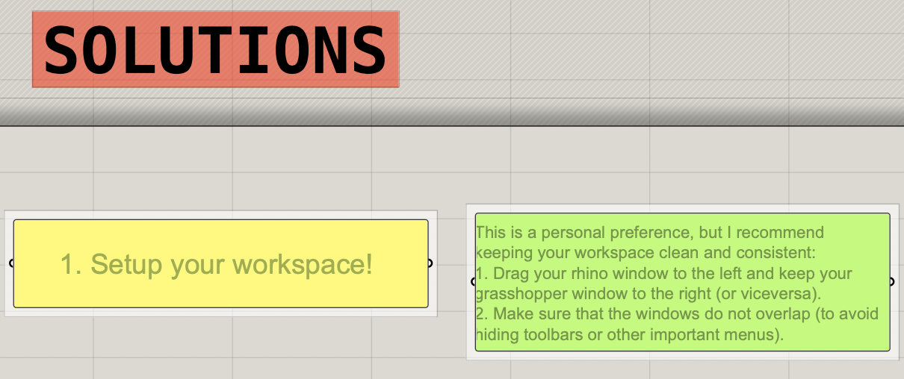
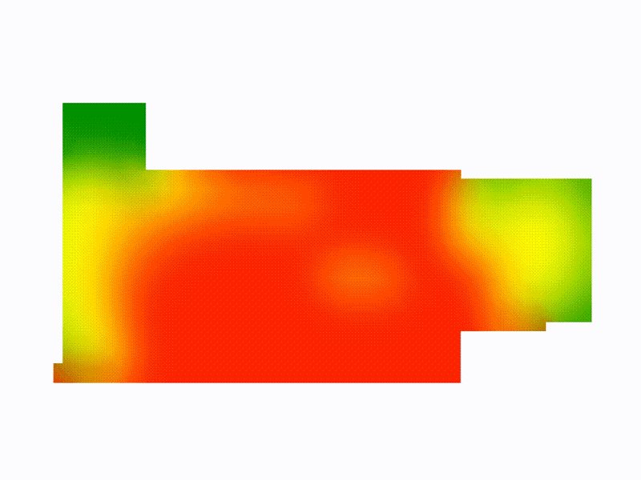

# ADR2 GSAPP Grasshopper Demos
Grasshopper example files for ADR2 GSAPP.

## 1) Warmup
A series of fast-paced warmup exercises recommended for those new to Grasshopper or wanting to reinforce basic functionalities. 
[warmup.3dm + .gh files](1_warmup)

The .gh file contains two columns:
- **CHALLENGES** (left column): Simple exercises to solve sequentially.

- **SOLUTIONS** (right column): Reference these to validate your work or if you get stuck with the challenges. This column includes instructions to solve the challenges along with some hints and explanations.

## 2a) Heatmaps

This demo showcases spatial data visualization through heatmaps. The Grasshopper file includes examples with increasing complexity.

Files
- [vis-analysis.gh](2a_visibility-analysis/vis-analysis.gh)
- [vis-analysis.3dm](2a_visibility-analysis/vis-analysis.3dm)

Dependencies:
- https://www.food4rhino.com/en/app/human
- How to install plugins? Follow this tutorial: https://parametricbydesign.com/grasshopper/tutorials/installing-grasshopper-and-plugins/

## 2) Place while you draw

GH files:
- [simple demo to show placing logic](2_place_people/place-stuff_section-mini.gh)
- [more advanced demo](2_place_people/place-stuff_section.gh)

3DM file: 
- [Rhino reference file for mini version](2_place_people/placepeep-mini.3dm)
- [Rhino reference file for advanced version](2_place_people/placepeep.3dm)

Dependencies:
- https://www.food4rhino.com/en/app/human
- How to install plugins? Follow this tutorial: https://parametricbydesign.com/grasshopper/tutorials/installing-grasshopper-and-plugins/

Inputs:
- Any curve geometry.
- 2D shapes to randomly place along your curve geometry.

Outputs:
- Randomly placed 2D shapes along your curve geometry.

## 3) Python Warmup!
A series of fast-pace Python in Grasshopper exercises.

GH file:
- [download "python-warmup.gh"](4_python-warmup)

Dependencies:
- https://www.food4rhino.com/en/app/human (if you don't have it it's ok)
